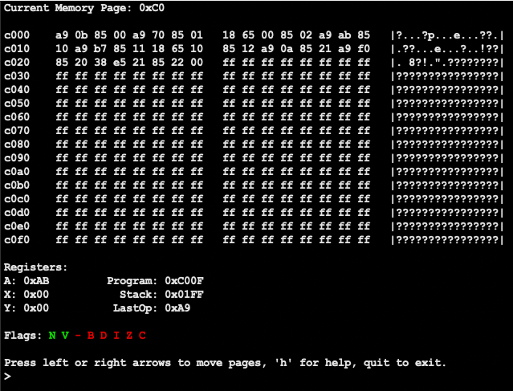

# 65c02 Emulator

This is a C program to emulate a 65c02 processor. 

You can follow my blog posts about this project at [on my website](https://www.ahl27.com/tags/#emulator)!

Priorities for this project are:
  1. Working emulation of 6502 instruction set
  2. Working emulation of 65c02 instruction set
  3. Recreating clock cycles per instruction
  4. Faithful recreation of 65c02 bugs (ex. indirect jump to page boundary)

**Note that this is a personal project, if you need really accurate emulation of a 6502 please check out [Symon](https://github.com/sethm/symon)**

## Running the Project

To install, clone the repository and run `make` from within the base directory of the project. 

To run 6502 assembly code, run `build/6502emu.out path/to/file.o65`. As an example, you can run
tests in the test suite such as:

```
> ./build/6502emu.out tests/loadstore.o65
```

This will open the GUI and display the memory and registers. Use the left/right arrow keys to move one page, or use the up/down keys (or scroll) to move 16 pages at a time. You can also type in a specific page to go to (ex. `01` to jump to page `0x10`). Typing `home` will return you to the page the program counter is currently on. `step` runs a single instruction, and `step n` will run `n` instructions. `run` will run the program until a `BRK` command is encountered, at which point control is returned to the user. Running `run` again will then run until the second `BRK` command is encountered, and so on. You can use `help` to display this information in the GUI, and `quit` to quit.



## Known Issues / Future Updates

1. Flag display will be adjusted at a later date to support people with difficulty differentiating red/green
2. GUI will look like garbage if the window is too small--make sure your window is large enough
3. 65c02 instructions are not currently supported but will (probably) be implemented later
4. Not all instructions have been tested; all loads/stores/transfers plus `ADC, SBC` are known to be working. More testing on the way.
5. Clock cycles are not quite the same as the original 6502, I'll try to get to it later.
